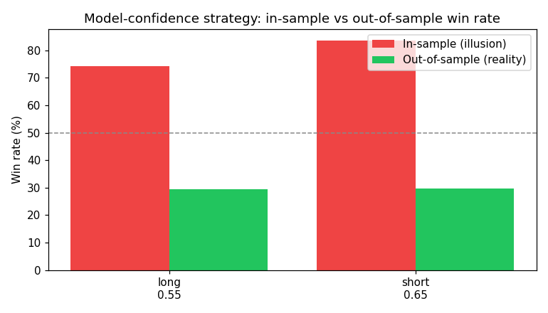
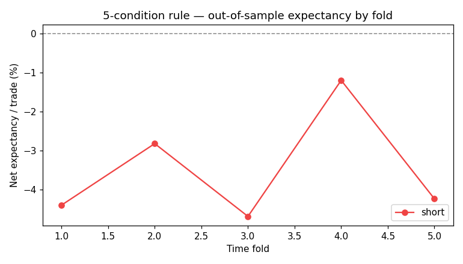

# SOLUSDT Strategy Analysis Report

_Generated 2026-06-01 01:09:15 UTC by `generate_report.py` — every number and chart below comes
straight from a deterministic engine run. Re-running with the same inputs
reproduces this report exactly._

> ⚠️ **Data source: SYNTHETIC (deterministic demo).** Live Binance klines were unavailable when this ran, so the numbers below come from generated bars with no real edge — they exist to prove the pipeline is honest, not to recommend a trade. Re-run where `fapi.binance.com` is reachable for a real-market report.

**Run:** `SOLUSDT` · 60 days · RR `2:1` (target 1.0% / stop 0.5%) · 10x · round-trip cost 0.09%

---

## 1. Verdict

**No strategy passed the out-of-sample robustness gate on this window.** On no-edge data that is the correct, honest result: the engine refuses to manufacture an edge that is not there.

The point of this report is methodological honesty:

- **Model-confidence strategies** are scored on **out-of-sample** (purged
  walk-forward) predictions, not the in-sample fit. The in-sample win rate is
  shown only to expose how large the overfitting gap is.
- A strategy is **robust** only when it is profitable out-of-sample, consistent
  across folds, statistically significant (shuffle p < 0.05), and has enough
  trades. In-sample expectancy ranks nothing.

---

## 2. Model-confidence grid search (out-of-sample)

The in-sample column is the "96% win rate" illusion; the OOS column is what a
model that cannot peek at the test bars actually achieves.

**LONG** — walk-forward avg test AUC `0.512` (min `0.474`), shuffle p-value `0.100`, valid=False

| Strategy | OOS win rate | OOS PF | OOS expectancy | In-sample WR | Robust | Score | Warnings |
|---|---|---|---|---|---|---|---|
| `long_threshold_0.55` | 29.4% | 0.52 | -2.231% | 74.3% | ❌ | 13.1 | in-sample only — fails out-of-sample gate; AUC≈random (0.512) — likely overfit; not significant (p=0.100); inconsistent across folds (stability=0.40); negative out-of-sample expectancy |
| `long_threshold_0.7` | 28.8% | 0.52 | -2.279% | 90.2% | ❌ | 13.1 | in-sample only — fails out-of-sample gate; AUC≈random (0.512) — likely overfit; not significant (p=0.100); inconsistent across folds (stability=0.40); negative out-of-sample expectancy |
| `long_threshold_0.6` | 28.9% | 0.52 | -2.282% | 81.0% | ❌ | 13.1 | in-sample only — fails out-of-sample gate; AUC≈random (0.512) — likely overfit; not significant (p=0.100); inconsistent across folds (stability=0.40); negative out-of-sample expectancy |
| `long_threshold_0.65` | 28.5% | 0.51 | -2.350% | 86.5% | ❌ | 13.1 | in-sample only — fails out-of-sample gate; AUC≈random (0.512) — likely overfit; not significant (p=0.100); inconsistent across folds (stability=0.40); negative out-of-sample expectancy |

**SHORT** — walk-forward avg test AUC `0.512` (min `0.467`), shuffle p-value `0.100`, valid=False

| Strategy | OOS win rate | OOS PF | OOS expectancy | In-sample WR | Robust | Score | Warnings |
|---|---|---|---|---|---|---|---|
| `short_threshold_0.65` | 29.6% | 0.54 | -2.176% | 83.5% | ❌ | 18.2 | in-sample only — fails out-of-sample gate; AUC≈random (0.512) — likely overfit; not significant (p=0.100); negative out-of-sample expectancy |
| `short_threshold_0.6` | 29.5% | 0.53 | -2.236% | 78.5% | ❌ | 18.2 | in-sample only — fails out-of-sample gate; AUC≈random (0.512) — likely overfit; not significant (p=0.100); negative out-of-sample expectancy |
| `short_threshold_0.55` | 29.3% | 0.51 | -2.304% | 70.4% | ❌ | 18.2 | in-sample only — fails out-of-sample gate; AUC≈random (0.512) — likely overfit; not significant (p=0.100); negative out-of-sample expectancy |
| `short_threshold_0.7` | 28.5% | 0.52 | -2.312% | 87.5% | ❌ | 18.2 | in-sample only — fails out-of-sample gate; AUC≈random (0.512) — likely overfit; not significant (p=0.100); negative out-of-sample expectancy |

---

## 3. Five-condition rule strategy (2:1)

Transparent rule (4H trend · 1H BOS · 15m FVG · ATR>60pct · Vol>70pct), AND-ed
on each leakage-safe 1m close, backtested out-of-sample with a bootstrap
significance test and a random-entry baseline.

**LONG** — insufficient signals (n=5 < 30) (signals fired: 5)

**SHORT** (SHORT 2:1) — ❌ NOT ROBUST

| Metric | Value |
|---|---|
| Trades | 198 |
| Win rate | 24.7% |
| Profit factor | 0.38 |
| Net expectancy / trade | -3.135% |
| Sharpe (per-trade) | -0.49 |
| Bootstrap p-value | 1.000 |
| Edge vs random WR | -2.8% |
| Edge vs random expectancy | -0.552% |
| Fold stability | 0.00 |
| Warnings | negative expectancy; not significant (p=1.000); inconsistent across folds (stability=0.00); no edge vs random-entry baseline |

---

## 4. How to read this

- **Win rate alone means nothing.** A model that memorises the training set hits
  >90% in-sample and ~30-50% out-of-sample. Only the OOS number is tradeable.
- **Robustness gate, not vanity metrics.** Ranking is by a 0-100 score blending
  walk-forward AUC, fold stability, shuffle significance, and low train/test
  degradation.
- **Determinism.** Seeded RNGs + single-threaded XGBoost mean identical inputs
  produce identical numbers, so this report is reproducible and auditable.

> Disclaimer: backtested results, not investment advice. Crypto futures trading
> carries substantial risk. A passing robustness gate is a necessary, not
> sufficient, condition for live deployment — forward-test before risking capital.
