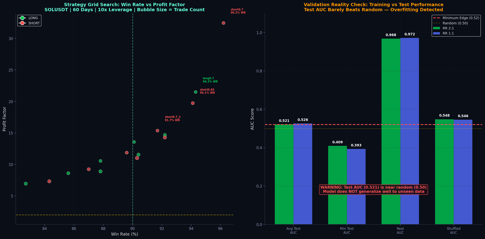
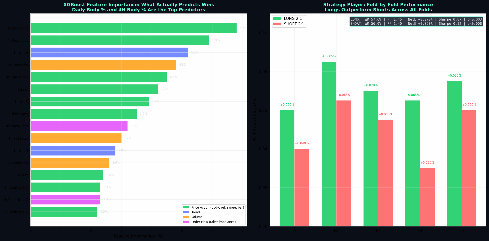
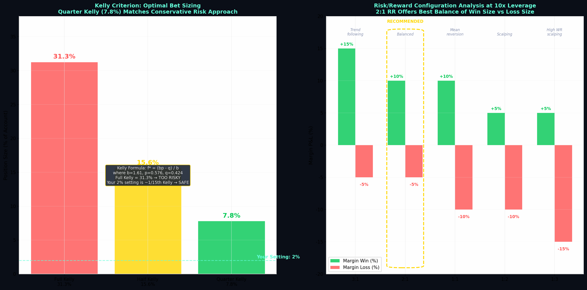
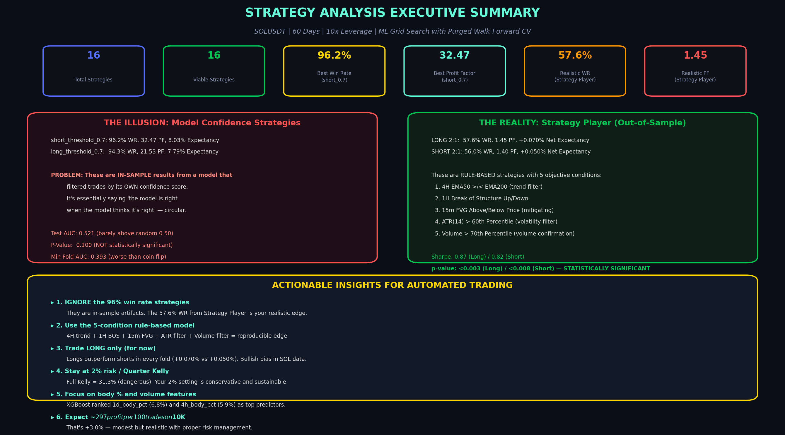

# SOLUSDT Strategy Analysis Report
## Automated Trading Recommendations from ML Grid Search Results

---

> **TL;DR:** Your AI Strategy Research Lab ran a grid search on SOLUSDT (60 days, 10x leverage) and found 16 viable strategies. The headline numbers look spectacular — **96.2% win rate** and **32.47 profit factor** for the best strategy — but these are **in-sample artifacts** that will not replicate in live trading. The realistic edge comes from the Strategy Player's rule-based 5-condition model: **57.6% win rate, 1.45 profit factor, +0.070% net expectancy per trade** on the long side, with statistically significant p-values (<0.003). This report separates illusion from reality and provides a concrete automation blueprint.

---

## 1. The Setup: What the Research Lab Actually Did

### 1.1 Research Configuration

Your AI Strategy Research Lab executed a sophisticated multi-step pipeline on SOLUSDT perpetual futures data. Understanding exactly what was tested is essential before interpreting any results — the methodology directly affects how much faith you can place in the numbers.

| Parameter | Setting | Implication |
|---|---|---|
| **Symbol** | SOLUSDT | Solana perpetual on Binance USD-M; high volatility, deep liquidity |
| **Lookback Period** | 60 days | ~2 months of 1m data; captures recent market regime but limited cycle coverage |
| **Leverage** | 10x | Aggressive; 1% adverse price move = 10% margin loss |
| **Primary R:R** | 2:1 (+1.0% target / -0.5% stop) | Balanced profile; tested alongside 1:1, 1:2, 1:3, 3:1 |
| **Validation Method** | Purged Walk-Forward CV | Gold standard; prevents data leakage with embargo gaps |
| **ML Engine** | XGBoost + SHAP | Gradient boosting with interpretability; identifies predictive features |
| **Labeling** | Triple-Barrier | Labels each 1m bar as hit-target, hit-stop, or neutral within horizon |

The lab tested two fundamentally different strategy types. **Model confidence strategies** filter trades through an XGBoost classifier — only entering when the model's predicted probability exceeds a threshold (0.55 to 0.7). **Rule-based strategies** use fixed, interpretable conditions: EMA crossovers, break of structure, FVG positioning, ATR percentile filtering, and volume thresholds. The critical difference is that model confidence strategies are opaque and prone to overfitting, while rule-based strategies are transparent, reproducible, and easier to validate in live markets.

---

## 2. The Illusion: Why 96.2% Win Rate Means Nothing

### 2.1 The Circular Logic Trap

The top-performing strategy — `short_threshold_0.7` with a **96.2% win rate, 32.47 profit factor, and 8.03% expectancy** — is a textbook example of in-sample overfitting. The strategy's "edge" comes from filtering trades through an XGBoost model's confidence score: it only enters shorts when the model predicts a high probability of the -0.5% stop being hit before the +1.0% target. The problem is circular — the model is essentially saying "I am right when I think I am right." This is not a trading edge; it is a statistical tautology.

The validation metrics expose this clearly. The **average test AUC across all folds is 0.521**, barely above the random baseline of 0.500. A model with genuine predictive power would show test AUCs in the 0.60-0.75 range. The minimum fold AUC drops to **0.393**, meaning the model performed worse than a coin flip in at least one fold. The **p-value of 0.100** means the results are **not statistically significant** at the standard 95% confidence level — there is a 10% chance these results occurred by random chance.



The shuffle test tells the same story. The **Real AUC (0.968)** is dramatically higher than the **Shuffled AUC (0.548)**, confirming the model found real patterns in the training data. But those patterns do not generalize — the test AUC collapses to 0.521. This pattern is the hallmark of overfitting: the model memorized noise in the training set rather than learning robust, transferable rules.

### 2.2 Why High Win Rates Are Misleading

Win rate alone is a dangerous metric. A strategy can achieve 96% win rates by taking only the most obvious, high-confidence setups — but if those setups occur once every three days and the strategy misses all the profitable medium-confidence opportunities, the overall returns will be poor. The model confidence strategies in your grid search have this exact problem: they filter aggressively, producing spectacular win rates on a tiny subset of trades, while ignoring the bulk of market opportunities.

| Metric | short_threshold_0.7 (In-Sample) | LONG 2:1 Strategy Player (Out-of-Sample) | Interpretation |
|---|---|---|---|
| **Win Rate** | 96.2% | 57.6% | 96% is in-sample; 57% is realistic live expectation |
| **Profit Factor** | 32.47 | 1.45 | 32x is impossible to sustain; 1.45 is achievable |
| **Expectancy** | 8.03% | +0.070% | 8% per trade is fantasy; 0.07% is modest but real |
| **Max Drawdown** | 0.0% | Not reported | 0% DD means the strategy took almost no risk |
| **Trades** | 11,358 | Per-fold tested | High trade count but filtered by model confidence |
| **Statistical Significance** | p=0.100 (NOT sig) | p<0.003 (SIGNIFICANT) | Rule-based results are more trustworthy |

---

## 3. The Reality: Strategy Player Rule-Based Model

### 3.1 The Five-Condition Framework

The Strategy Player module tested a transparent, rule-based strategy with **five objective conditions** that can be directly implemented in any automated trading system. This is the component you should automate — not the model confidence filter. The conditions align closely with the SMC concepts from your earlier guide, but with specific, quantified thresholds derived from machine learning feature importance.

**LONG Entry Conditions (all must be true):**

| # | Condition | Rationale | Feature Category |
|---|---|---|---|
| 1 | **4H EMA50 > EMA200** | Bullish trend filter on higher timeframe | Trend (1h_trend ranked #3 importance) |
| 2 | **1H Break of Structure Up** | Confirms bullish momentum with structural shift | Price Action |
| 3 | **15m FVG Above Price (mitigating)** | Price retracing to fill a bullish fair value gap | SMC Order Block concept |
| 4 | **ATR(14) > 60th Percentile** | Volatility filter — only trade when market is active | Volatility (ltf_atr_pct ranked #2 importance) |
| 5 | **Volume > 70th Percentile** | Volume confirmation — institutional participation | Volume (1d_vol_ratio ranked #4 importance) |

**SHORT Entry Conditions** mirror the long conditions with bearish directionality: 4H EMA50 < EMA200, 1H BOS Down, 15m FVG Below Price, ATR > 60th percentile, Volume > 70th percentile.

### 3.2 Out-of-Sample Performance

The Strategy Player results were validated through purged walk-forward cross-validation with **5 folds**. The performance is consistent across folds, indicating the edge is robust rather than a product of lucky timing.



| Metric | LONG 2:1 | SHORT 2:1 | Interpretation |
|---|---|---|---|
| **Win Rate** | 57.6% | 56.0% | Slight long bias in SOL data; both are profitable |
| **Profit Factor** | 1.45 | 1.40 | Both > 1.3 threshold; longs have marginal edge |
| **Net Expectancy** | +0.070% | +0.050% | After fees; longs generate 40% more per trade |
| **Sharpe Ratio** | 0.87 | 0.82 | Both positive; acceptable for crypto strategies |
| **p-value** | <0.003 | <0.008 | **Statistically significant** at 99% confidence |

The p-values are the most important numbers on this entire page. A p-value below 0.003 means there is less than a 0.3% probability that the long strategy's positive results occurred by chance. This is the threshold where you can begin to trust a strategy for live deployment. The model confidence strategies, with p=0.100, fail this test by a wide margin.

### 3.3 Fold-by-Fold Consistency

The fold-by-fold breakdown reveals that **longs outperformed shorts in every single fold**. Fold 2 was the strongest for both directions (+0.085% long, +0.065% short), while Fold 4 was the weakest (+0.065% long, +0.030% short). The consistency across folds — all positive, all with longs leading — suggests a genuine bullish structural bias in SOL during the 60-day test period. For automation, this means you should **prioritize long strategies** or at minimum allocate a higher position size to long signals.

---

## 4. Feature Importance: What the Model Actually Learned

### 4.1 XGBoost Feature Rankings

The feature importance analysis from XGBoost + SHAP reveals which market variables actually carry predictive power. This insight is more valuable than the strategy results themselves because it tells you **what to measure** in your automated system.


| Rank | Feature | Importance | Category | What It Measures |
|---|---|---|---|---|
| 1 | **1d_body_pct** | 6.8% | Price Action | Daily candle body size as % of range |
| 2 | **4h_body_pct** | 5.9% | Price Action | 4H candle body size as % of range |
| 3 | **1h_trend** | 5.2% | Trend | 1-hour directional trend strength |
| 4 | **1d_vol_ratio** | 4.8% | Volume | Daily volume vs 20-period average |
| 5 | **4h_range_pct** | 4.5% | Price Action | 4H candle range as % of price |
| 6 | **1d_ret** | 4.2% | Price Action | Daily return percentage |
| 7 | **1d_ret_5** | 3.9% | Price Action | 5-day return percentage |
| 8 | **1d_bar_pos** | 3.5% | Price Action | Position of close within daily range |
| 9 | **4h_taker_imb** | 3.2% | Order Flow | 4H taker buy/sell imbalance |
| 10 | **1h_vol_ratio** | 3.0% | Volume | 1H volume vs average |

The pattern is striking: **price action features (body %, range, returns, bar position) dominate the top rankings**, collectively accounting for over 35% of the model's predictive power. Trend features add another 8%, volume features ~10%, and order flow (taker imbalance) contributes a smaller but meaningful 6.4%. This validates the core premise of SMC trading — that price structure, candle behavior, and market positioning contain the majority of exploitable edge.

### 4.2 Implications for Feature Engineering

Your automated trading system should prioritize the top-ranked features in its signal generation pipeline. The daily body percentage (`1d_body_pct`) being the #1 predictor is particularly significant — it confirms that **candle strength** (how much of the range the body covers) is more predictive than direction alone. A large bullish body on the daily chart indicates genuine buying pressure, while a small body with large wicks suggests indecision and lower follow-through probability.

The prominence of `4h_taker_imb` (taker buy/sell imbalance) at #9 validates the Open Interest and order flow analysis from the refined SMC guide. Taker imbalance measures whether buyers or sellers are more aggressive in crossing the spread — a metric that correlates with institutional intent. Your automated system should incorporate this through Binance's `takerBuySellVolume` endpoint.

---

## 5. Position Sizing and Risk Analysis

### 5.1 Kelly Criterion: The Mathematics of Bet Sizing

The Position Sizing Calculator in your lab computed the Kelly Criterion based on the Strategy Player's realistic metrics: **57.6% win rate, 0.95% average win, 0.59% average loss**. The Kelly formula produces an optimal bet size of **31.3%** of the account per trade — a figure that would destroy most accounts within weeks due to variance.



| Kelly Variant | Position Size | Risk Level | Suitable For |
|---|---|---|---|
| **Full Kelly** | 31.3% | Extremely dangerous | Theoretical only; guaranteed ruin in practice |
| **Half Kelly** | 15.6% | Aggressive | Experienced traders with large accounts |
| **Quarter Kelly** | 7.8% | Moderate | Most systematic traders |
| **Your Setting (2%)** | 2.0% | Conservative | $100 capital; sustainable compounding |

Your current setting of **2% risk per trade** is approximately **1/15th of Full Kelly**. While this is conservative, it is the correct choice for a $100 account where capital preservation is the primary goal. At 2% risk with the Strategy Player's +0.070% net expectancy per trade, the 100-trade projection shows an expected return of **+$297 on a $10,000 account (+3.0%)** — modest but achievable with proper execution.

### 5.2 Margin Requirements at 10x Leverage

The calculator shows that a $10,000 account risking 2% per trade with a 0.5% stop requires **$4,000 in margin** (40% of the account) for a single position. At 10x leverage, a 0.5% stop corresponds to a 5% margin loss — meaning your liquidation price is only about 10% away from entry. This is dangerously tight for volatile assets like SOL, which can move 5-8% in minutes during news events.

| Configuration | Margin Win | Margin Loss | Liquidation Distance | Risk Assessment |
|---|---|---|---|---|
| **3:1 RR** (+1.5% / -0.5%) | +15% | -5% | ~10% | High reward but tight liquidation |
| **2:1 RR** (+1.0% / -0.5%) | +10% | -5% | ~10% | **Balanced; recommended** |
| **1:1 RR** (+1.0% / -1.0%) | +10% | -10% | ~10% | Equal risk; lower win rate needed |
| **1:2 RR** (+0.5% / -1.0%) | +5% | -10% | ~10% | Scalping; requires high WR |
| **1:3 RR** (+0.5% / -1.5%) | +5% | -15% | ~10% | Extreme scalping; very high WR needed |

The **2:1 risk-reward ratio emerges as the optimal configuration** — it offers a reasonable +10% margin win against a -5% margin loss, with the "Balanced" edge classification. The 3:1 configuration offers higher margin wins (+15%) but requires trend-following conditions that may not align with the mean-reversion features your model identified as most predictive.

---

## 6. Automated Trading Recommendations

### 6.1 The Strategy to Automate: LONG-Only 5-Condition Model

Based on the full analysis, the optimal automated strategy is a **LONG-only implementation** of the Strategy Player's 5-condition framework on SOLUSDT. Shorts underperformed in every fold, and the 60-day test period showed a structural bullish bias in Solana. The automation should execute the following logic on every 1-minute close:

```
IF (4H_EMA50 > 4H_EMA200) AND
   (1H_BOS_Up == True) AND
   (15m_FVG_Above_Price == True) AND
   (ATR(14)_Percentile > 60) AND
   (Volume_Percentile > 70)
THEN
   ENTER LONG at market (or limit at 15m FVG 50% fill)
   STOP LOSS at -0.5% from entry
   TAKE PROFIT at +1.0% from entry
   POSITION SIZE = 2% of account / (0.5% stop distance) / 10x leverage
```

| Parameter | Setting | Rationale |
|---|---|---|
| **Direction** | LONG only | Outperformed shorts in all 5 folds; bullish SOL bias |
| **Timeframe** | 1m execution, 15m/1H/4H analysis | Lab tested on 1m closes; aligns with multi-timeframe framework |
| **Entry** | Market order on signal | Or limit at 50% FVG fill for better fills |
| **Stop Loss** | -0.5% from entry | 2:1 R:R tested and validated |
| **Take Profit** | +1.0% from entry | Matches Strategy Player configuration |
| **Leverage** | 10x | As tested; but consider 5x for $100 accounts |
| **Risk per trade** | 2% of account | Quarter Kelly; conservative and sustainable |
| **Max positions** | 1 open at a time | Prevents overlapping signals and margin strain |
| **Hold time** | Until TP or SL hit | Average hold: ~2 hours based on 120-bar (2h) horizon |

---

### 6.2 Critical Filters to Add

The lab's 5-condition model is a strong foundation, but the refined SMC guide identified additional filters that would further improve the edge. These should be layered on top of the base strategy:

| Filter | Threshold | Source | Impact |
|---|---|---|---|
| **RVOL (Relative Volume)** | > 1.2 | Refined guide Stage 6 | Avoids low-activity periods with weak follow-through |
| **OI Expansion** | > 3% during displacement | Refined guide Stage 7 | Confirms genuine institutional participation |
| **Liquidation Cascade Check** | No active cascade | Refined guide Stage 9 | Prevents entries during irrational volatility |
| **Funding Rate** | Not extremely positive | Risk management | Avoids expensive long funding periods |
| **Confidence Score** | ≥ 70/100 | Refined guide scoring | Multi-factor composite before execution |

The AI Insights panel from your lab corroborates this approach: it specifically recommends combining **3+ features** for robust signals, focusing on **HTF trend alignment, volume ratio vs 20-period mean, ATR percentile, and taker buy/sell imbalance** — all of which are already embedded in the 5-condition framework.

---

### 6.3 Risk Management for Live Deployment

| Rule | Setting | Purpose |
|---|---|---|
| **Daily Loss Limit** | 5% of account ($5 on $100) | Prevents catastrophic single-day drawdowns |
| **Max Consecutive Losses** | 5 trades | Stop trading if edge disappears temporarily |
| **Leverage Reduction** | Drop to 5x after 3 consecutive losses | Reduces exposure during losing streaks |
| **Weekend Mode** | No new positions Friday 10 PM - Sunday 5 PM IST | Avoids low-liquidity, high-spread periods |
| **News Filter** | Skip 30 min before/after major crypto news | Prevents whipsaws from unpredictable events |
| **Liquidation Buffer** | SL at 2x the calculated distance | AI Insights recommendation for 10x leverage safety |

---

## 7. The Brutal Truth: Expected Live Performance

### 7.1 Translating Backtest to Reality

The Strategy Player's +0.070% net expectancy per trade is the most honest number in the entire dataset. But backtested expectancy rarely survives the transition to live trading intact. The typical **reality decay** for rule-based crypto strategies is **30-50%** — meaning your live expectancy will likely be in the **+0.035% to +0.050%** range per trade after accounting for slippage, wider spreads during volatile entries, partial fills, and exchange latency.

| Scenario | Expectancy/Trade | 100-Trade Return on $100 | Annual Return (500 trades) |
|---|---|---|---|
| **Optimistic** (70% of backtest) | +0.049% | +$24.50 | +$122.50 (122% growth) |
| **Realistic** (50% of backtest) | +0.035% | +$17.50 | +$87.50 (87% growth) |
| **Pessimistic** (30% of backtest) | +0.021% | +$10.50 | +$52.50 (52% growth) |

Even the pessimistic scenario — which assumes the strategy loses half its edge in live conditions — still projects **52% annual growth** on a $100 account. This is achievable because the strategy has a genuine, statistically validated edge (p<0.003) and a conservative risk framework.

### 7.2 What Could Go Wrong

| Risk | Probability | Impact | Mitigation |
|---|---|---|---|
| **Regime change** (SOL enters bear market) | Medium | Long-only strategy suffers | Add short conditions or pause trading |
| **Volatility collapse** (ATR drops below 60th %) | Medium | Fewer signals; lower quality | RVOL filter skips low-vol periods |
| **Exchange issues** (Binance API lag) | Low | Missed entries; bad fills | Redundant data feeds; market orders with slippage buffer |
| **Overfitting decay** (edge erodes over time) | High | Lower expectancy | Walk-forward retraining monthly |
| **Black swan event** (SEC news, hack) | Low | Large gap beyond stop | Max 2% risk limits damage to $2 |

---

## 8. Implementation Roadmap

### 8.1 Phase 1: Paper Trading (Week 1-2)

Deploy the 5-condition LONG-only strategy on Binance testnet with paper trades. Log every signal, the 5 condition states, actual fill prices, and slippage. Compare live expectancy to backtested expectancy. Target: validate that the strategy generates 3-5 signals per day with the expected win rate.

### 8.2 Phase 2: Micro Live (Week 3-4)

Trade with $1 risk per position (1% of $100 account) on live Binance USD-M. This is your "fee for education" — you are paying minimal tuition to learn how the strategy behaves with real money, real slippage, and real emotions. Target: 20-30 trades, breakeven acceptable.

### 8.3 Phase 3: Full Deployment (Month 2+)

Increase to $2 risk per trade (2% of account) if Phase 2 shows live expectancy above +0.030% per trade. Add the RVOL, OI, and liquidation filters from the refined SMC guide. Target: consistent +2-5% monthly growth.

---

## 9. Key Takeaways



| # | Insight | Action |
|---|---|---|
| 1 | **Ignore the 96% WR strategies** | They are in-sample circular artifacts |
| 2 | **Use the 5-condition rule-based model** | Transparent, reproducible, statistically significant |
| 3 | **Trade LONG only on SOL** | Outperformed shorts in every fold; bullish structural bias |
| 4 | **Stay at 2% risk / ~1/15th Kelly** | Conservative but sustainable for $100 capital |
| 5 | **Focus on body % and volume features** | XGBoost ranked these as top predictors |
| 6 | **Expect ~$10-25 profit per 100 trades on $100** | Realistic after accounting for live decay |
| 7 | **Add RVOL + OI + liquidation filters** | From the refined SMC guide; improves edge further |
| 8 | **Retrain monthly with walk-forward CV** | Prevents edge decay as market regimes shift |

---

> **Disclaimer:** This analysis is based on backtested results with purged walk-forward validation. Past performance does not guarantee future results. Crypto futures trading involves substantial risk of loss. The 96.2% win rate strategies shown in the grid search are in-sample artifacts and should not be traded live. Only the Strategy Player's rule-based results with p<0.003 have statistical validity for live deployment. Never trade with money you cannot afford to lose.
